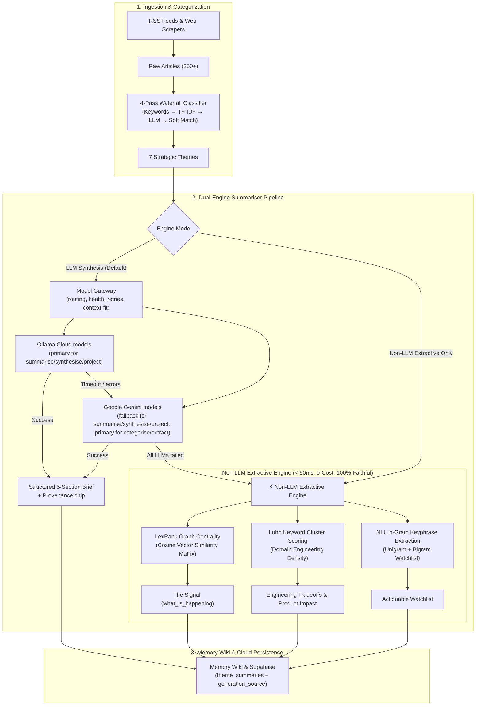

# AI Pulse Architecture

## Classification Modes

The classifier supports two modes, controlled from the **Quality Evaluation → 🧭 Classification Mode** tab (`config/custom_settings.json`):

- **Hybrid (default):** Runs the full 4-pass waterfall (keywords → TF-IDF → LLM → heuristic). Used when you expect some articles to need LLM disambiguation.
- **Deterministic:** Skips the LLM gate. Articles that miss keywords and TF-IDF go straight to the heuristic fallback. Ideal once keyword coverage is mature — gate stats are persisted and the UI suggests switching when the LLM gate catches fewer than 5% of articles for 5 consecutive runs.

```
Hybrid:       Keywords → TF-IDF → LLM (Gateway) → Heuristic
Deterministic: Keywords → TF-IDF → Heuristic
```

## System Architecture

```
┌─────────────────────────────────────────────────────────────────┐
│                        AI Pulse App                              │
├─────────────────────────────────────────────────────────────────┤
│  Pages                                                           │
│  ┌──────────┐ ┌──────────┐ ┌──────────┐ ┌──────────┐ ┌────────┐│
│  │ Overview │ │ Deep Dive│ │ Keyword │ │ Sources  │ │ Memory ││
│  │  (Home)  │ │          │ │ Analysis│ │          │ │  Wiki  ││
│  └──────────┘ └──────────┘ └──────────┘ └──────────┘ └────────┘│
│  ┌──────────────────┐ ┌──────────────────────────────────────┐ │
│  │  Trend Analytics │ │       Quality Evaluation             │ │
│  │  (cross-run)     │ │  (LLM-as-judge, weekly cadence,      │ │
│  │                  │ │   live progress, Supabase-backed)    │ │
│  └──────────────────┘ └──────────────────────────────────────┘ │
│  ┌────────────────────────────────────────────────────────────┐ │
│  │  Feedback & Roadmap — submit features/bugs; user_feedback  │ │
│  │  Supabase table, SDD prompts, public roadmap tracker.     │ │
│  └────────────────────────────────────────────────────────────┘ │
├─────────────────────────────────────────────────────────────────┤
│  Core Intelligence Layer                                         │
│  • AI Gateway    (multi-model routing, fallback chains, health   │
│                   tracking, deterministic fallback, provenance;  │
│                   Ollama primary for summarise/synthesise/       │
│                   project, Gemini fallback)                        │
│  • Fetcher       (concurrent RSS + web scraping)                 │
│  • Classifier    (4-pass waterfall: keywords → TF-IDF → optional │
│                   LLM → soft-match; gate counters tracked;        │
│                   hybrid/deterministic mode)                      │
│  • TF-IDF Classifier (cosine-similarity fallback for gate 2)     │
│  • Summariser    (gateway synthesis with memory-injection        │
│                   + provenance; non-LLM extractive fallback)     │
│  • Non-LLM Summariser (extractive LexRank/Luhn fallback)         │
│  • Provenance    (chip renderer + banner stripper)               │
│  • History Mgr   (JSON + Markdown + Supabase persistence)        │
│  • Cache         (st.cache_data 12h TTL + .cache/ disk JSON)     │
│  • BG Refresher  (daemon thread, non-blocking pipeline)          │
│  • Shared Sidebar (consistency across all pages)               │
│  • LLM Client    (legacy Ollama wrapper — quota flags with       │
│                   self-healing probe, backoff retries, LLM_DEBUG)│
│  • Gemini Client (on-demand Google Gemini synthesis + fallback)  │
│  • Sage Agent    (Memory Wiki chat — chronological citations;    │
│                   automatic Gemini fallback)                     │
│  • Evaluator     (3 LLM-as-judge + 4 deterministic, weekly run)  │
│  • Quality Schema (Supabase table for evaluator results)         │
│  • Design System (shared CSS tokens for visual consistency)      │
├─────────────────────────────────────────────────────────────────┤
│  Configuration Layer                                             │
│  • config/settings.py   (Ollama endpoint, model, lookback, TTL)  │
│  • config/themes.py     (7 weighted-keyword theme dicts)         │
│  • config/sources.py    (RSS feeds + web-scrape registry)        │
│  • config/Appendix_*.md (experts, blogs, papers watchlists)      │
│  • watch.md             (user's keyword / engineering blog list) │
└─────────────────────────────────────────────────────────────────┘
```

## Dual-Engine Summarization Architecture



## Routing Policies

The gateway routes each task type to a primary model with an ordered fallback chain:

| Task | Primary | Fallback 1 | Fallback 2 | Fallback 3 | Deterministic |
|---|---|---|---|---|---|
| categorise | gemini-3.5-flash-lite | gemini-3.5-flash | nemotron-3-super | gpt-oss-120b | Yes |
| extract | gemini-3.5-flash-lite | gemini-3.5-flash | nemotron-3-super | gpt-oss-120b | Yes |
| summarise | nemotron-3-super | gpt-oss-120b | gemini-3.6-flash | gemini-3.5-flash | Yes |
| synthesise | nemotron-3-super | gpt-oss-120b | gemini-3.6-flash | gemini-3.5-flash | Yes |
| project | nemotron-3-super | gpt-oss-120b | gemini-3.6-flash | gemini-3.5-flash | Yes |

All providers have per-request timeouts:
- **Gemini:** 30s default (configurable via `GEMINI_REQUEST_TIMEOUT`)
- **Ollama:** 60s default (configurable via `OLLAMA_REQUEST_TIMEOUT`)

When a provider times out or fails, the gateway classifies the error (retryable vs non-retryable), records the failure for health tracking, and moves to the next model in the chain. If all LLMs fail, the deterministic fallback uses `extractive_summarise_from_text()` for SUMMARISE/SYNTHESISE tasks and rule-based extraction for CATEGORISE/EXTRACT.

## Self-Improving Keywords

After each classification run, the system analyses articles that fell through to the LLM/heuristic gate:

- **Auto-apply:** Terms appearing in 3+ articles for the same theme (and not already a keyword in another theme) are automatically added to the theme's keyword dict via `add_keywords_to_theme()`. Persisted to `config/custom_keywords.json`.
- **Pending review:** Lower-confidence candidates (2 articles) are stored in the Supabase `keyword_suggestions` table with status `pending` for review in the Theme Keyword Manager.

This is a purely heuristic loop — zero LLM cost — so keyword coverage improves run-over-run without external dependencies.
