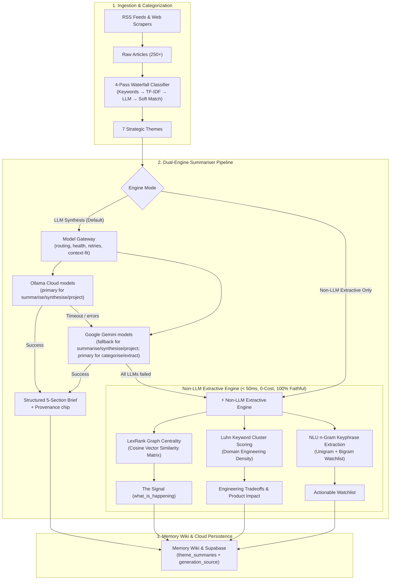

# AI Pulse Architecture

## Data Pipeline

`fetcher` → `classifier` → `summariser` → `history_manager` → (optional) `supabase_client`.
Runs synchronously on first run or in a background daemon thread via `core/bg_refresher.py`
(singleton `BackgroundRefresher`).

## Classification Modes

The classifier supports two modes, controlled from the **Quality Evaluation → 🧭 Classification Mode** tab (`config/custom_settings.json`):

- **Hybrid (default):** Runs the full 4-pass waterfall (keywords → TF-IDF → LLM → heuristic). Used when you expect some articles to need LLM disambiguation.
- **Deterministic:** Skips the LLM gate. Articles that miss keywords and TF-IDF go straight to the heuristic fallback. Ideal once keyword coverage is mature — gate stats are persisted and the UI suggests switching when the LLM gate catches fewer than 5% of articles for 5 consecutive runs.

```
Hybrid:       Keywords → TF-IDF → LLM (Gateway) → Heuristic
Deterministic: Keywords → TF-IDF → Heuristic
```

### The 4-pass waterfall (`core/classifier.py`)

1. `gate_1_keyword` — weighted keyword matching (integer weights 1–3 in `config/themes.py`,
   highest score wins).
2. `gate_2_tfidf` — TF-IDF cosine similarity against synthetic theme documents
   (`core/tfidf_classifier.py`, zero-dependency, sub-millisecond).
3. `gate_3_llm` — LLM classification through the Model Gateway (fallback + provenance).
   Before querying the gateway, a cross-run classification cache
   (`core/classification_cache.py`, keyed by content_hash — Supabase `articles` table
   lookup + `data/classification_cache.json` local mirror) reuses themes assigned in
   previous runs; cache hits are tallied in `gate_3_cache_hits` and cached themes missing
   from the current `THEMES` registry fall through to the LLM.
4. `gate_4_heuristic` — `find_closest_theme()` relaxed soft match.

Gate counts are exposed via `get_latest_gate_stats()` (keys `gate_1_keyword` …
`gate_4_heuristic`, plus `gate_3_cache_hits`) and surfaced in the UI.

Theme keywords are weighted dicts — higher weight = stronger signal for both gate 1 and
TF-IDF synthetic documents. Edit `config/themes.py` to retrain the classifier.

## System Architecture

```
┌─────────────────────────────────────────────────────────────────┐
│                        AI Pulse App                              │
├─────────────────────────────────────────────────────────────────┤
│  Pages                                                           │
│  ┌──────────┐ ┌──────────┐ ┌──────────┐ ┌──────────┐ ┌────────┐│
│  │ Overview │ │ Deep Dive│ │ Keyword │ │ Sources  │ │ Memory ││
│  │  (Home)  │ │          │ │ Analysis│ │          │ │  Wiki  ││
│  └──────────┘ └──────────┘ └──────────┘ └──────────┘ └────────┘│
│  ┌──────────────────┐ ┌──────────────────────────────────────┐ │
│  │  Trend Analytics │ │       Quality Evaluation             │ │
│  │  (cross-run)     │ │  (LLM-as-judge, weekly cadence,      │ │
│  │                  │ │   live progress, Supabase-backed)    │ │
│  └──────────────────┘ └──────────────────────────────────────┘ │
│  ┌────────────────────────────────────────────────────────────┐ │
│  │  Feedback & Roadmap — submit features/bugs; user_feedback  │ │
│  │  Supabase table, SDD prompts, public roadmap tracker.     │ │
│  └────────────────────────────────────────────────────────────┘ │
├─────────────────────────────────────────────────────────────────┤
│  Core Intelligence Layer                                         │
│  • AI Gateway    (multi-model routing, fallback chains, health   │
│                   tracking, deterministic fallback, provenance;  │
│                   Ollama primary for summarise/synthesise/       │
│                   project, Gemini fallback)                        │
│  • Fetcher       (concurrent RSS + web scraping)                 │
│  • Classifier    (4-pass waterfall: keywords → TF-IDF → optional │
│                   LLM → soft-match; gate counters tracked;        │
│                   hybrid/deterministic mode)                      │
│  • TF-IDF Classifier (cosine-similarity fallback for gate 2)     │
│  • Summariser    (gateway synthesis with memory-injection        │
│                   + provenance; non-LLM extractive fallback)     │
│  • Non-LLM Summariser (extractive LexRank/Luhn fallback)         │
│  • Provenance    (chip renderer + banner stripper)               │
│  • History Mgr   (JSON + Markdown + Supabase persistence)        │
│  • Cache         (st.cache_data 12h TTL + .cache/ disk JSON)     │
│  • BG Refresher  (daemon thread, non-blocking pipeline)          │
│  • Shared Sidebar (consistency across all pages)               │
│  • LLM Client    (legacy Ollama wrapper — quota flags with       │
│                   self-healing probe, backoff retries, LLM_DEBUG)│
│  • Gemini Client (on-demand Google Gemini synthesis + fallback)  │
│  • Sage Agent    (Memory Wiki chat — chronological citations;    │
│                   automatic Gemini fallback)                     │
│  • Evaluator     (3 LLM-as-judge + 4 deterministic, weekly run)  │
│  • Quality Schema (Supabase table for evaluator results)         │
│  • Design System (shared CSS tokens for visual consistency)      │
├─────────────────────────────────────────────────────────────────┤
│  Configuration Layer                                             │
│  • config/settings.py   (Ollama endpoint, model, lookback, TTL)  │
│  • config/themes.py     (7 weighted-keyword theme dicts)         │
│  • config/sources.py    (RSS feeds + web-scrape registry)        │
│  • watch.md             (user's keyword / engineering blog list) │
└─────────────────────────────────────────────────────────────────┘
```

## Dual-Engine Summarization Architecture


```mermaid
flowchart TD
    subgraph Ingestion ["1. Ingestion & Categorization"]
        RSS["RSS Feeds & Web Scrapers"] --> Ingest["Raw Articles (250+)"]
        Ingest --> Classifier["4-Pass Waterfall Classifier\n(Keywords → TF-IDF → LLM → Soft Match)"]
        Classifier --> Themed["7 Strategic Themes"]
    end

    subgraph Summariser ["2. Dual-Engine Summariser Pipeline"]
        Themed --> ModeCheck{"Engine Mode"}

        ModeCheck -- "LLM Synthesis (Default)" --> Gateway["Model Gateway\n(routing, health, retries, context-fit)"]
        Gateway --> Ollama["Ollama Cloud models\n(primary for summarise/synthesise/project)"]
        Gateway --> Gemini["Google Gemini models\n(fallback for summarise/synthesise/project; primary for categorise/extract)"]
        Ollama -- "Success" --> StructOut["Structured 5-Section Brief\n+ Provenance chip"]
        Gemini -- "Success" --> StructOut
        Ollama -- "Timeout / errors" --> Gemini
        Gemini -- "All LLMs failed" --> NonLLMFallback["⚡ Non-LLM Extractive Engine"]

        ModeCheck -- "Non-LLM Extractive Only" --> NonLLMFallback

        subgraph NonLLMEngine ["Non-LLM Extractive Engine (< 50ms, 0-Cost, 100% Faithful)"]
            NonLLMFallback --> LexRank["LexRank Graph Centrality\n(Cosine Vector Similarity Matrix)"]
            NonLLMFallback --> Luhn["Luhn Keyword Cluster Scoring\n(Domain Engineering Density)"]
            NonLLMFallback --> Keyphrase["NLU n-Gram Keyphrase Extraction\n(Unigram + Bigram Watchlist)"]

            LexRank --> Signal["The Signal (what_is_happening)"]
            Luhn --> TechTradeoffs["Engineering Tradeoffs & Product Impact"]
            Keyphrase --> Watchlist["Actionable Watchlist"]
        end
    end

    subgraph Storage ["3. Memory Wiki & Cloud Persistence"]
        StructOut --> Wiki["Memory Wiki & Supabase\n(theme_summaries + generation_source)"]
        Signal --> Wiki
        TechTradeoffs --> Wiki
        Watchlist --> Wiki
    end
```

## Routing Policies

The gateway routes each task type to a primary model with an ordered fallback chain:

| Task | Primary | Fallback 1 | Fallback 2 | Fallback 3 | Deterministic |
|---|---|---|---|---|---|
| categorise | gemini-3.5-flash-lite | gemini-3.8-flash | nemotron-3-ultra | gpt-oss-120b | Yes |
| extract | gemini-3.5-flash-lite | gemini-3.8-flash | nemotron-3-ultra | gpt-oss-120b | Yes |
| summarise | nemotron-3-ultra | gpt-oss-120b | gemini-3.6-flash | gemini-3.8-flash | Yes |
| synthesise | nemotron-3-ultra | gpt-oss-120b | gemini-3.6-flash | gemini-3.8-flash | Yes |
| project | nemotron-3-ultra | gpt-oss-120b | gemini-3.6-flash | gemini-3.8-flash | Yes |

All providers have per-request timeouts:
- **Gemini:** 30s default (configurable via `GEMINI_REQUEST_TIMEOUT`)
- **Ollama:** 180s default (configurable via `OLLAMA_REQUEST_TIMEOUT`) — cloud models like nemotron can exceed 60s under load, which used to trip premature fallbacks

When a provider times out or fails, the gateway classifies the error (retryable vs non-retryable), records the failure for health tracking, and moves to the next model in the chain (each fallback logs a WARNING naming the failed model and error). Health latches: 3 consecutive failures → degraded, 5 → unavailable. An unavailable model is not skipped forever — a circuit-breaker auto-reset retries it in half-open state after a cooldown (`GATEWAY_HEALTH_RESET_SECONDS`, default 300s), and a successful `health_check_all()` probe clears the latch immediately. If all LLMs fail, the deterministic fallback uses `extractive_summarise_from_text()` for SUMMARISE/SYNTHESISE tasks and rule-based extraction for CATEGORISE/EXTRACT.

## Model Gateway Internals (`core/ai_gateway/`)

The Model Gateway is the central LLM abstraction. **New LLM work should go through the
gateway** (`get_gateway().execute(AITaskRequest(...))`), not raw clients. The legacy
`_get_llm()` module-level `LLMClient` singletons (`threading.Semaphore(3)`) remain in
classifier/summariser only for backward compatibility and quota state.

- `contracts.py` — `TaskType` (categorise / extract / summarise / synthesise / project /
  evaluate), `AITaskRequest`, `AITaskResult`, `ErrorType` (retryable / non_retryable /
  output_failure), and `Provenance` (provider, model, latency, attempts, fallback chain,
  correlation id). `EVALUATE` is the LLM-as-judge task (core/evaluator.py
  `GatewayJudgeLLM` adapter): Gemini-first routing, verbatim prompts (no template
  wrapping), no output schema, and `deterministic_fallback: False` — a rule-based judge
  verdict is meaningless, so failures surface and samples are excluded.
- `gateway.py` — `ModelGateway` singleton via `get_gateway()`. Holds a **model registry +
  per-task routing policies** (primary + ordered fallback chain, currently Gemini flash
  models + Ollama cloud models). Per-model health tracking (3 consecutive failures →
  degraded, 5 → unavailable, with the circuit-breaker auto-reset described above),
  context-fit check (input must fit ~60% of the model's window), exponential-backoff
  retries, JSON-schema validation, WARNING-level logs on every fallback transition, and a
  final **deterministic fallback** when all LLMs fail. Ollama request timeout defaults to
  180s (`OLLAMA_REQUEST_TIMEOUT`) because cloud models can exceed 60s under load.
- `providers/` — `GeminiProvider` and `OllamaCloudProvider` async adapters behind
  `ProviderAdapter`.
- `deterministic.py` — zero-LLM fallbacks: `rule_categorise`, `extractive_summarise`,
  `keyword_extract`, `statistical_projection`.
- Callers: `core/classifier.py` (pass 3) and `core/summariser.py` call
  `get_gateway().execute(AITaskRequest(...))` inside `asyncio.run(...)`.

## Dual-Engine Summarization Detail

### 1. Gateway LLM synthesis (`generate_theme_summary_gateway`)

- A structured 5-section intelligence brief: **What Is Happening / Engineering Tradeoffs /
  Product Impact / Actionable Watchlist / Strategic Further Reading**, with length
  instructions scaled to article count.
- Articles are relevance-ranked (`_rank_articles_by_relevance`) and truncated to a char
  budget derived from `num_ctx`.
- Themes whose article hashes were all seen before are skipped (`gateway:skipped`) —
  summaries are skipped entirely when article content hashes are unchanged
  (`get_articles_hash()` / `_get_existing_article_hashes()`).
- Prior-run memory is injected via `get_recent_context()` so briefs report evolutions,
  not static updates.

### 2. Non-LLM extractive engine (`core/non_llm_summariser.py`)

LexRank graph centrality + Luhn keyword-cluster scoring + n-gram keyphrase extraction;
<50ms, zero-cost, 100% extractive. Used when the gateway fails completely, and forced when
the user selects "⚡ Non-LLM Extractive Only" (`st.session_state.summariser_mode`).

### 3. On-demand Gemini Deep Dive

`generate_gemini_theme_summary` + `core/gemini_client.py` — per-theme Deep Dive
re-summarisation with up to `MAX_ARTICLES_PER_GEMINI_SUMMARY` (75) articles; on HTTP 429
the UI suggests switching to another model from `GEMINI_AVAILABLE_MODELS`.

### Provenance

Every summary dict carries provenance via `_with_provenance()`: `_source` token (e.g.
`"google:gemini-3.6-flash"`, `"ollama:…"`, `"extractive_fallback"`, `"gateway:error"`),
`_generation_log`, and optionally the full `_provenance` dict. `core/provenance.py` maps
`_source` to the coloured UI chip; Supabase persists it in
`theme_summaries.generation_source` / `generation_log`.

## Quota Management (`core/llm_client.py`)

Legacy Ollama wrapper, still the shared client for Sage and quota state. Quota exhaustion
is tracked process-wide via flags on the `sys` module (`_aipulse_llm_quota_exceeded` …);
`LLMClient.is_quota_exceeded()` / `mark_quota_exceeded()` / `reset_quota_status()` manage
it, and `probe_quota_status()` hits `/api/tags` to self-heal the flag instantly when quota
recovers (called before refresh runs). A process-local empty-response streak counter lets
the summariser degrade the rest of a run to the extractive engine instead of burning
retries. Set `LLM_DEBUG=1` to log prompts/responses on failures.

## Memory System (Three Layers)

- `history.json` — machine-readable run history with full articles, themed articles, and
  summaries.
- `memory.md` — human-readable wiki that appends each run as a new section.
- Supabase (PostgreSQL) — cloud persistence for cross-device access; auto-backfilled from
  `history.json` on first load; degrades gracefully (`is_available()` returns `False`
  without env vars). See [docs/SUPABASE.md](SUPABASE.md).

`core/history_manager.py` exposes `get_recent_context()` (injects the last 2 runs'
summaries into LLM prompts) and `purge_run()`.

## Caching & Batching

- **LLM calls are batched** where possible (classification/evaluation), and summaries are
  skipped entirely when article content hashes are unchanged.
- **Two-layer cache**: `st.cache_data` (12h TTL) wraps every expensive step; `.cache/*.json`
  disk cache survives restarts; content-based SHA-256 hashing prevents redundant LLM calls.
- **Logs** go to `logs/app.log` via `core/logger.py` (`setup_logger(__name__)`).

## Self-Improving Keywords

After each classification run, the system analyses articles that fell through to the LLM/heuristic gate:

- **Auto-apply:** Terms appearing in 3+ articles for the same theme (and not already a keyword in another theme) are automatically added to the theme's keyword dict via `add_keywords_to_theme()`. Persisted to `config/custom_keywords.json`.
- **Pending review:** Lower-confidence candidates (2 articles) are stored in the Supabase `keyword_suggestions` table with status `pending` for review in the Theme Keyword Manager.

This is a purely heuristic loop — zero LLM cost — so keyword coverage improves run-over-run without external dependencies.
